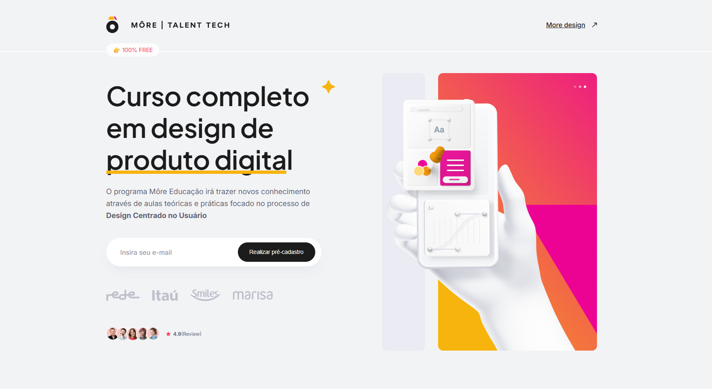

# 🌟 More | Talent Tech - Landing Page de Curso de Design de Produto Digital



Projeto desenvolvido para apresentar o curso completo de **Design de Produto Digital** da Môre Educação, destacando módulos, projetos práticos e redes sociais. O objetivo é criar uma landing page moderna, responsiva e intuitiva, com foco em conversão e experiência do usuário.

---

## 🔗 Links Importantes

- **Acesse o deploy do projeto:** [Clique aqui](https://lp-codeboost-ui.netlify.app/)  
- **Pré-visualização da imagem:** 

---

## 🛠 Tecnologias Utilizadas

O projeto foi desenvolvido com foco em **front-end**, utilizando as seguintes tecnologias:

- **HTML5:** Estrutura semântica do site.
- **CSS3 (Modular):** Estilização organizada em arquivos separados (`variables.css`, `reset.css`, `fonts.css`, `grid.css`, `header.css`, `home.css`) e importados no `main.css`.
- **Flexbox & Grid:** Layouts responsivos e alinhamento de elementos.
- **Google Fonts:** `Inter` e `Plus Jakarta Sans` para tipografia moderna.
- **Responsividade:** Media queries aplicadas para tablets e mobile.
- **Imagens e Ícones:** SVGs otimizados para performance e clareza visual.

---

## 🎨 Estrutura do Projeto
project-root/
│
├─ img/ # Imagens e ícones do projeto
├─ styles/
│ ├─ variables.css # Variáveis de cores e fontes
│ ├─ reset.css # Reset de estilos padrões do navegador
│ ├─ fonts.css # Configuração de fontes
│ ├─ grid.css # Sistema de grid e containers
│ ├─ header.css # Estilização do header
│ ├─ home.css # Estilização da página home
│ └─ main.css # Arquivo principal que importa todos os outros
├─ index.html # Página principal
└─ README.md # Documentação do projeto

--

## 🖥 Funcionalidades

- **Header fixo e responsivo** com logo, botão de call-to-action e links de redes sociais.
- **Sessão Hero** com destaque para o curso, pré-cadastro de e-mail e parceiros.
- **Sessão Cards** mostrando módulos, aulas ao vivo e projetos práticos.
- **Responsividade completa** para desktop, tablet e mobile.
- **Uso de variáveis CSS** para cores e fontes, garantindo consistência visual.

---

## 🚀 Como Rodar o Projeto

1. Clone este repositório:
```bash
git clone https://seurepositorio.com/project-name.git